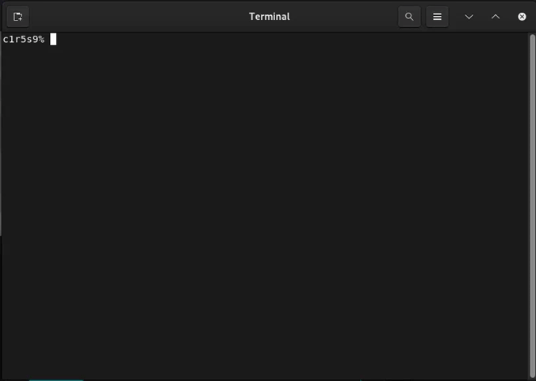

# minishell
>As beautiful as a shell

</p>
<p align="center">
	<a href="#about">About</a> •
	<a href="#usage">Usage</a> •
   	<a href="#implementation">Implementation</a> •
	<a href="#norme">Norme</a>
</p>


## About
The Minishell project is the first group project in the Common Core of school 42 and consists of creating a miniature version of bash in C. It must replicate key features of bash such as executing commands, displaying error messages, pipes, redirections, signals, exit codes, and quote handling. Minishell is the most complex and extensive project I've undertaken so far and I recommend that anyone who has yet to start this project plan carefully, coordinate and divide the workload with your partner, and take a step-by-step approach and only move on to the next stage of the project once the current one has been completed.

This was a group project done with [gabrrodr](https://github.com/gabrrodr).



## Implementation

Our implementation of the **minishell** program can be divided into the following steps:

**Expander**<br>
The Expander processes an input string by replacing any environment variables with their values.

**Lexer**<br>
The Lexer tokenizes the user input, creating a linked list of tokens and words. It handles quotes and detects if a special character is present (pipe, redirection).

**Parser**<br>
The parser groups tokens into commands, manages redirections and determines if the input is a system command or a builtin function. The data is structured to be used in the Executor.

**Builtins**<br>
Built-in commands, such as `echo`, `cd`, `pwd`, `export`, `unset`, `env`, and `exit`, are commands that are directly handled by the shell itself without invoking external executables.

**Executor**<br>
The executor manages the execution of commands, handling multiple commands, pipes, and child processes. It ensures proper communication between commands through pipes.

## Usage
#### 1st - Clone the repository
``` bash
$ git clone git@github.com:MartimPinto/minishell.git
```
#### 2nd - Enter the project folder and run make
``` bash
$ cd minishell

$ make
```
#### 3rd - Launch the Program
minishell can be launched now and functions just like bash. Feel free to test any command you can think of.
```bash
$ ./minishell
```
## Norme

All 42 projects must be written following the **Norme**.

	- No for, do while, switch, case or goto are allowed
	- No more than 25 lines per function and 5 functions per file
	- No assigns and declarations in the same line (unless static)
 	- Each line must be at most 80 columns wide, comments included
	- A function can take 4 named parameters maximum
	- No more than 5 variables in 1 function
